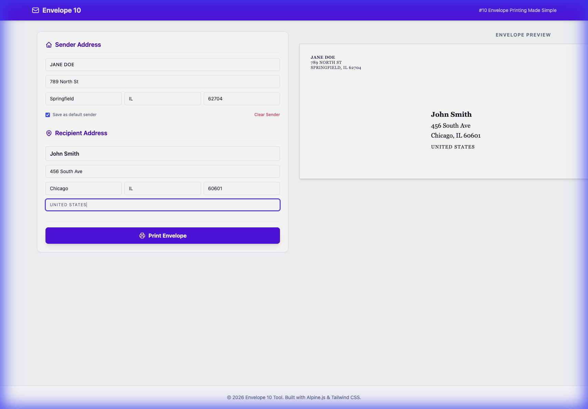

# Envelope 10 - Web Printing Tool

A modern, browser-based utility for printing standard #10 envelopes. No local installation required.

## 🚀 Live Demo
Access the tool here: **[https://martinfou.github.io/enveloppe10/](https://martinfou.github.io/enveloppe10/)**  

## ✨ Features
- **Real-time Preview**: See your envelope update as you type.
- **#10 Standard Proportions**: Fixed 9.5" x 4.125" layout for perfect postal alignment.
- **Privacy First**: All data remains in your browser's `localStorage`. No data is sent to any server.
- **Sender Persistence**: Save your return address as the default for future use.
- **Modern UI**: Clean, responsive interface built with Tailwind CSS and Alpine.js.

## 🖨️ Printing Tips
For best results, use the following settings in your browser's print dialog:
1. **Layout**: Landscape
2. **Paper Size**: #10 Envelope (or 4.125 x 9.5 inches)
3. **Margins**: None (or Minimum)
4. **Options**: Ensure "Background Graphics" is ON if you want the subtle preview borders (optional).

## 🛠️ Development
This project is built using:
- [Tailwind CSS](https://tailwindcss.com/) (via CDN)
- [Alpine.js](https://alpinejs.dev/) (via CDN)
- [GitHub Actions](https://github.com/features/actions) for automated deployment to GitHub Pages.

### Local Development
Simply open `index.html` in any modern web browser.

---
Built with ❤️ for simple printing.
