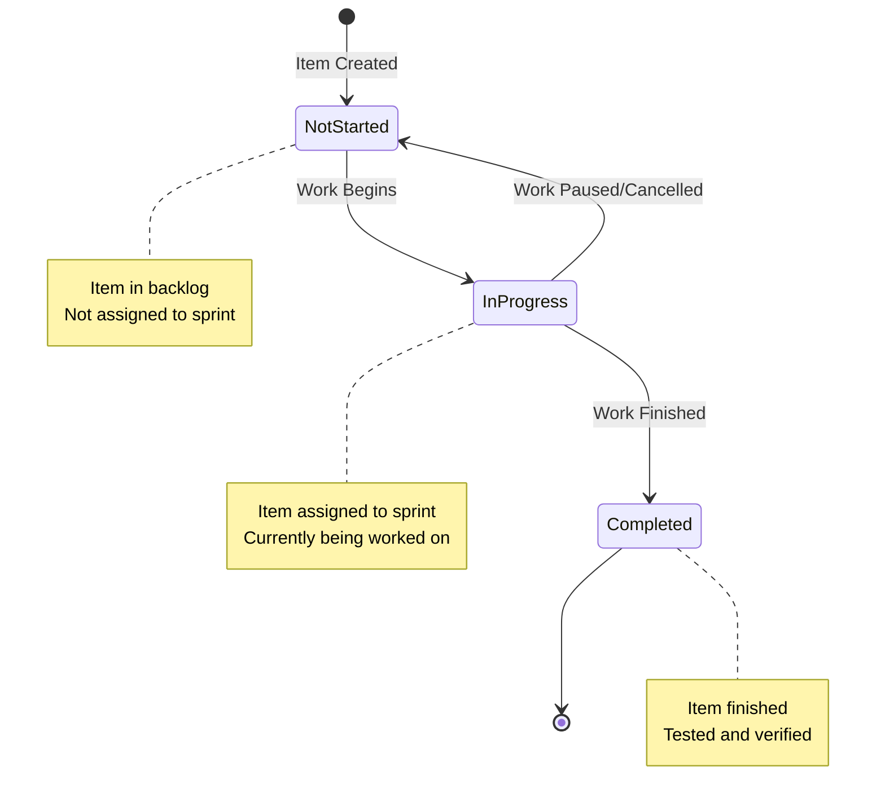
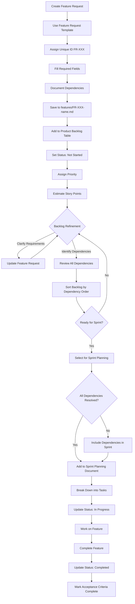
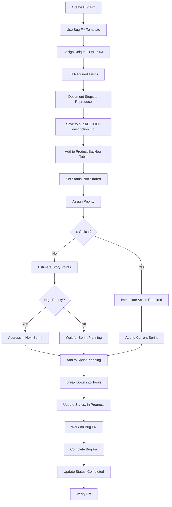

# Backlog Management Process

## Overview

This document defines the process for managing the product backlog, including how items are added, updated, prioritized, and linked to sprint planning.

**Reference**: 
- Product Backlog Structure: [product-backlog-structure.md](product-backlog-structure.md)
- Sprint Planning Template: [../templates/sprint-planning-template.md](../templates/sprint-planning-template.md)

## Backlog Lifecycle

### Status Lifecycle

```
⭕ Not Started → ⏳ In Progress → ✅ Completed
```

**Status Definitions**:
- **⭕ Not Started**: Item is in backlog, not yet assigned to a sprint or started
- **⏳ In Progress**: Item is currently being worked on (assigned to active sprint)
- **✅ Completed**: Item is finished, tested, and verified

### Status Lifecycle Diagram

The following diagram visualizes the status transitions for backlog items:



## Adding Items to Backlog

### Feature Request Process

1. **Create Feature Request**:
   - Use feature request template
   - Assign unique ID (FR-XXX or your ID format)
   - Fill in all required fields
   - Save to `features/[ID]-feature-name.md`

2. **Add to Main Backlog**:
   - Add entry to product backlog table in `product-backlog.md`
   - Set initial status: ⭕ Not Started
   - Assign priority based on business value
   - Estimate story points

3. **Backlog Refinement**:
   - Review during backlog refinement session
   - Clarify requirements if needed
   - Update priority if needed
   - Break down into tasks if large

#### Feature Request Workflow Diagram

The following diagram shows the complete workflow for feature requests from creation to completion:



### Bug Fix Process

1. **Create Bug Fix**:
   - Use bug fix template
   - Assign unique ID (BF-XXX or your ID format)
   - Fill in all required fields including steps to reproduce
   - Save to `bugs/[ID]-bug-description.md`

2. **Add to Main Backlog**:
   - Add entry to product backlog table
   - Set initial status: ⭕ Not Started
   - Assign priority (bugs are often high priority)
   - Estimate story points

3. **Immediate Action**:
   - Critical bugs may need immediate attention
   - High priority bugs should be addressed in next sprint
   - Medium/Low priority bugs can wait for sprint planning

#### Bug Fix Workflow Diagram

The following diagram shows the complete workflow for bug fixes from creation to completion, including decision points for critical bugs:



## Updating Backlog Items

### When Work Begins

**Status Change**: ⭕ Not Started → ⏳ In Progress

**Actions**:
1. Update status in feature request/bug fix file
2. Update status in main backlog table
3. Add "Assigned Sprint" field
4. Add entry to sprint planning document
5. Update "Updated" date

**Example**:
```markdown
**Status**: ⏳ In Progress  
**Assigned Sprint**: Sprint 1  
**Updated**: 2024-01-15

## History
- 2024-01-10 - Created
- 2024-01-15 - Status changed to ⏳ In Progress, Assigned to Sprint 1
```

### When Work Completes

**Status Change**: ⏳ In Progress → ✅ Completed

**Actions**:
1. Update status in feature request/bug fix file
2. Update status in main backlog table
3. Mark acceptance criteria as complete
4. Add completion notes
5. Update "Updated" date
6. Update sprint planning document (mark story as complete)

**Example**:
```markdown
**Status**: ✅ Completed  
**Updated**: 2024-01-22

## History
- 2024-01-10 - Created
- 2024-01-15 - Status changed to ⏳ In Progress, Assigned to Sprint 1
- 2024-01-22 - Status changed to ✅ Completed
```

## Backlog Refinement

### Refinement Sessions

**Frequency**: Weekly or bi-weekly (adjust to your team's needs)

**Participants**: Product Owner, Scrum Master, Development Team

**Agenda**:
1. Review new backlog items
2. Clarify requirements for unclear items
3. Estimate story points for unestimated items
4. Identify and document dependencies
5. Sort backlog by dependency order
6. Prioritize items
7. Break down large items
8. Remove obsolete items

### Refinement Checklist

For each backlog item:

- [ ] Description is clear and complete
- [ ] User story is well-defined (As a... I want... So that...)
- [ ] Acceptance criteria are specific and testable
- [ ] Story points are estimated (Fibonacci: 1, 2, 3, 5, 8, 13)
- [ ] Priority is assigned (🔴 Critical / 🟠 High / 🟡 Medium / 🟢 Low)
- [ ] Technical references are included
- [ ] Dependencies are identified
- [ ] Business value is documented

## Dependency Management

### Identifying Dependencies

Dependencies should be documented in each backlog item's "Dependencies" section. Common dependency types include:

- **Blocking Dependencies**: Item A must be completed before Item B can start
- **Enabling Dependencies**: Item A makes Item B easier or better, but not strictly required
- **Technical Dependencies**: Item A requires specific technical infrastructure from Item B
- **Data Dependencies**: Item A requires data structures or APIs from Item B
- **Feature Dependencies**: Item A builds upon functionality in Item B

### Sorting Backlog by Dependencies

**Process**:
1. **Review All Dependencies**: Go through each backlog item and verify dependencies are documented
2. **Create Dependency Graph**: Map out which items depend on which other items
3. **Identify Dependency Chains**: Find items that have no dependencies (can start immediately)
4. **Order by Dependency**: Sort backlog so items with dependencies come after their prerequisites
5. **Resolve Circular Dependencies**: If circular dependencies exist, break them by:
   - Combining items if they're tightly coupled
   - Splitting items to remove the circular dependency
   - Identifying a minimal implementation that breaks the cycle

**Sorting Rules**:
- Items with no dependencies should be at the top (ready to start)
- Items that depend on completed items should come next
- Items with uncompleted dependencies should be lower in the backlog
- Within the same dependency level, sort by priority (Critical → High → Medium → Low)

**Example Dependency Ordering**:
```
1. FR-001: User Authentication (no dependencies) - 🔴 Critical
2. FR-002: User Profile (depends on FR-001) - 🟠 High
3. FR-003: User Settings (depends on FR-002) - 🟡 Medium
4. FR-004: Advanced Features (depends on FR-001, FR-002) - 🟠 High
```

### Dependency Sorting Checklist

- [ ] All dependencies are documented in backlog items
- [ ] Dependency graph is created and reviewed
- [ ] Items are sorted so prerequisites come first
- [ ] Circular dependencies are identified and resolved
- [ ] Backlog table is updated to reflect dependency order
- [ ] Items with blocked dependencies are clearly marked

## Prioritization Process

### Prioritization Criteria

1. **Business Value**: How important is this to users?
2. **Technical Risk**: How risky is the implementation?
3. **Dependencies**: What other work depends on this? (Items with no dependencies are prioritized first)
4. **Effort**: How much work is required?
5. **Urgency**: How time-sensitive is this?

**Note**: After sorting by dependencies, prioritize within each dependency level using the criteria above.

### Priority Assignment

**🔴 Critical**:
- Blocks core functionality
- Security issues
- Data loss risks
- Must be addressed immediately

**🟠 High**:
- Important features for MVP
- Significant user value
- Should be addressed in next 1-2 sprints

**🟡 Medium**:
- Nice to have features
- Moderate user value
- Can wait for future sprints

**🟢 Low**:
- Future considerations
- Low user value
- Can be deferred indefinitely

## Linking to Sprint Planning

### Sprint Planning Process

1. **Select Items from Backlog**:
   - Review dependency-sorted backlog items
   - Select items for sprint based on:
     - Dependency order (items with completed dependencies first)
     - Priority (within same dependency level)
     - Team velocity
     - Sprint goal
   - Ensure all dependencies for selected items are either:
     - Already completed
     - Included in the same sprint
     - Planned for earlier sprints

2. **Add to Sprint Planning Document**:
   - Copy feature request/bug fix details
   - Break down into tasks
   - Assign story points to tasks
   - Add technical references

3. **Update Backlog Status**:
   - Change status to ⏳ In Progress
   - Add "Assigned Sprint" field
   - Update main backlog table

### Sprint Planning Checklist

- [ ] Backlog sorted by dependencies
- [ ] Dependencies for selected items are resolved (completed or in sprint)
- [ ] Backlog items selected for sprint
- [ ] Items added to sprint planning document
- [ ] Items broken down into tasks
- [ ] Tasks have technical references
- [ ] Story points estimated
- [ ] Backlog status updated
- [ ] Sprint goal defined

## Backlog Maintenance

### Regular Updates

**Daily**:
- Update status of in-progress items
- Add notes on progress

**Weekly**:
- Review backlog during refinement
- Update dependencies as needed
- Re-sort backlog by dependency order
- Update priorities if needed
- Remove obsolete items

**Sprint End**:
- Mark completed items as ✅ Completed
- Review incomplete items
- Move incomplete items to next sprint or back to backlog

### Backlog Cleanup

**Remove Items**:
- Obsolete features (no longer needed)
- Duplicate items
- Items that have been replaced

**Archive Items**:
- Completed items (keep for reference)
- Cancelled items (document why)

## Backlog Metrics

### Tracking Metrics

**Backlog Size**:
- Total number of items
- Items by priority
- Items by status

**Velocity Tracking**:
- Story points completed per sprint
- Average velocity
- Velocity trends

**Cycle Time**:
- Time from creation to completion
- Time in each status

### Reporting

**Sprint Review**:
- Show completed items
- Show backlog status
- Discuss upcoming items

**Stakeholder Updates**:
- High-priority items status
- Upcoming features
- Blocked items

## Best Practices

### Writing Good Backlog Items

1. **Clear Description**: What needs to be done?
2. **User Story Format**: As a... I want... So that...
3. **Acceptance Criteria**: Specific, testable criteria
4. **Technical References**: Link to relevant documents
5. **Business Value**: Why is this important?

### Managing Backlog

1. **Keep It Updated**: Regular refinement and updates
2. **Sort by Dependencies**: Always maintain dependency order
3. **Prioritize Regularly**: Review priorities frequently (within dependency levels)
4. **Break Down Large Items**: Keep items manageable
5. **Document Decisions**: Record why items are prioritized
6. **Communicate Changes**: Keep team informed

## References

- **Product Backlog Structure**: [product-backlog-structure.md](product-backlog-structure.md)
- **Sprint Planning Template**: [../templates/sprint-planning-template.md](../templates/sprint-planning-template.md)
- **Feature Request Template**: [../templates/feature-request-template.md](../templates/feature-request-template.md)
- **Bug Fix Template**: [../templates/bug-fix-template.md](../templates/bug-fix-template.md)

---

**Last Updated**: [Date]  
**Version**: 1.0  
**Status**: Backlog Management Process Complete

