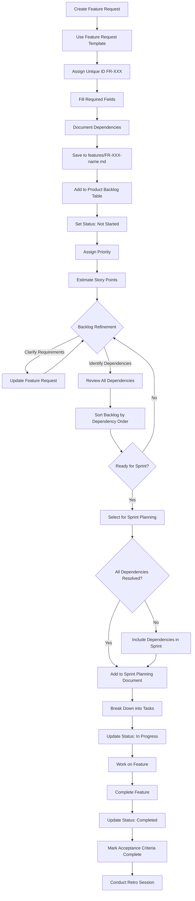
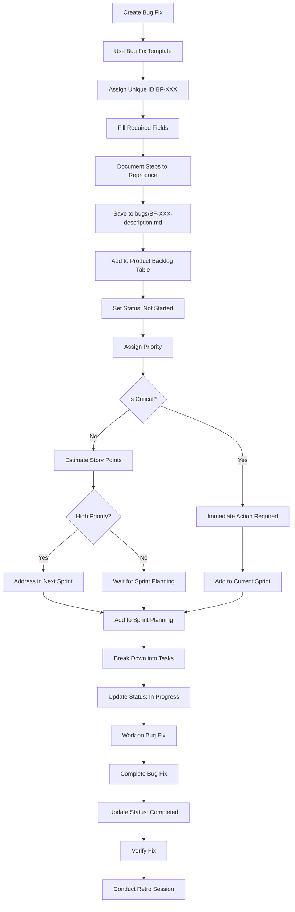
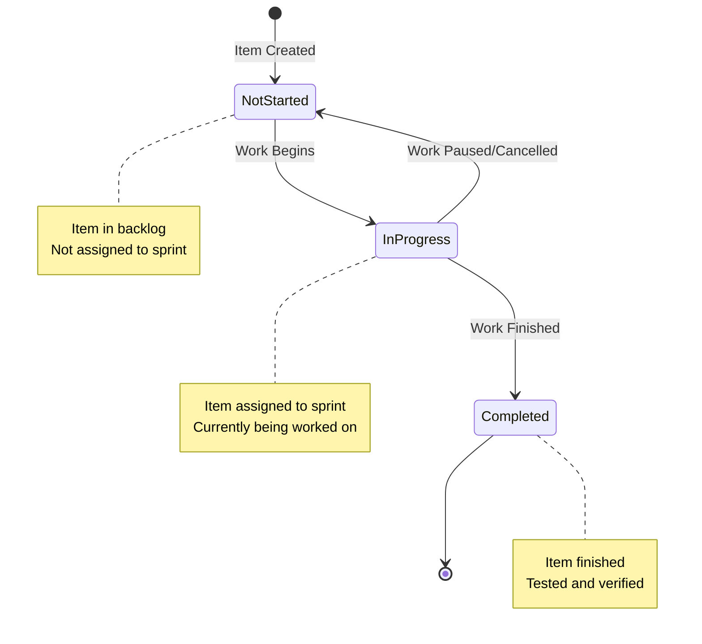

# Workflow Diagrams Example

This document demonstrates the Mermaid.js workflow diagrams used to visualize the backlog management process. These diagrams help team members understand how feature requests and bug fixes flow through the system.

## Feature Request Workflow

This flowchart shows the complete lifecycle of a feature request from initial creation through backlog management to sprint planning and completion.

**Key Steps**:
1. Create feature request using template and document dependencies
2. Add to product backlog with initial status
3. Go through backlog refinement including dependency identification
4. Sort backlog by dependency order
5. Select for sprint planning (ensuring dependencies are resolved)
6. Break down into tasks and work on feature
7. Complete and mark as done
8. Conduct sprint retrospective (retro session)

## Bug Fix Workflow

This flowchart shows the complete lifecycle of a bug fix, including decision points for critical bugs that require immediate attention.

**Key Decision Points**:
- **Critical Bugs**: Require immediate action and are added to current sprint
- **High Priority Bugs**: Should be addressed in next sprint
- **Medium/Low Priority Bugs**: Can wait for regular sprint planning

## Status Lifecycle

This state diagram shows the status transitions for backlog items throughout their lifecycle.

**Status Definitions**:
- **⭕ Not Started**: Item is in backlog, not yet assigned to a sprint or started
- **⏳ In Progress**: Item is currently being worked on (assigned to active sprint)
- **✅ Completed**: Item is finished, tested, and verified

## How to Use These Diagrams

1. **Reference During Process**: Use these diagrams as quick reference when working with backlog items
2. **Onboarding**: Share with new team members to help them understand the workflow
3. **Process Improvement**: Use as a basis for discussing process improvements
4. **Documentation**: Include in process documentation to provide visual context

## Integration

These diagrams are integrated into:
- `backlog-toolkit/processes/backlog-management-process.md` - Main process documentation
- Feature request template examples
- Sprint planning documentation

## Notes

- Diagrams use Mermaid.js syntax and render in most modern markdown viewers
- Diagrams should be updated if the process changes
- For best rendering, use markdown viewers that support Mermaid.js (GitHub, GitLab, VS Code with extensions, etc.)

